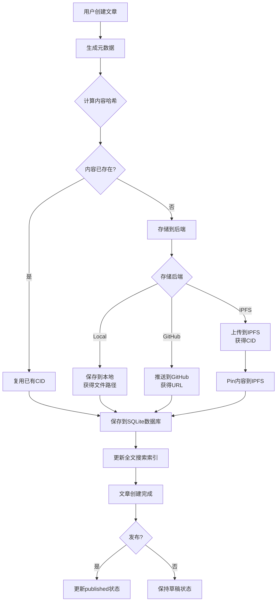
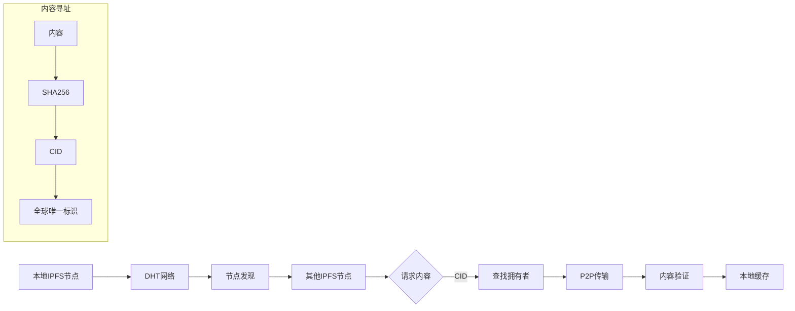
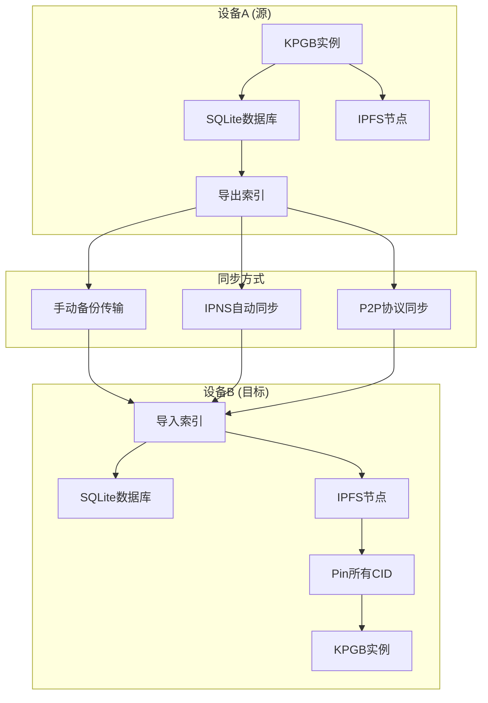
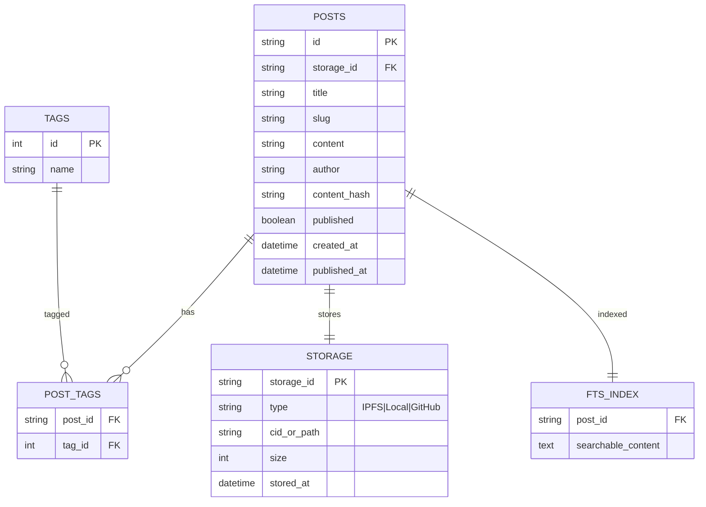
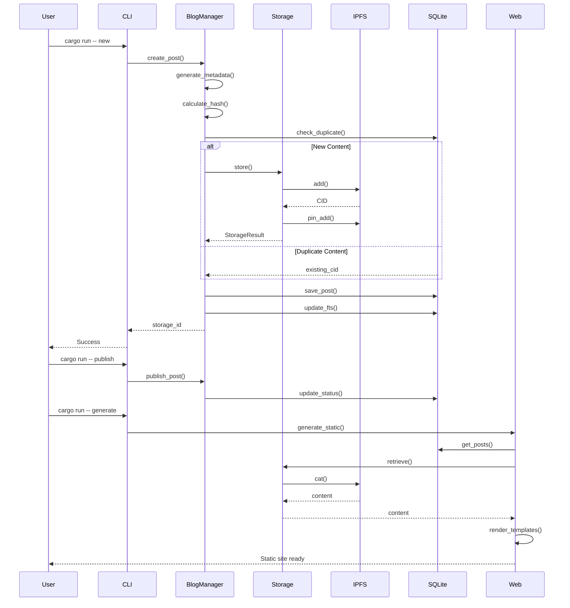
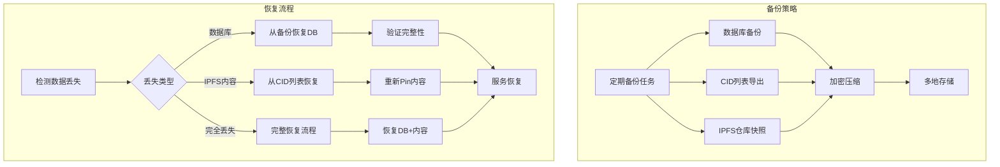

# KPGB 内容流程图

## 1. 新文章创建和发布流程

```mermaid
graph TD
    A[用户创建文章] --> B[生成元数据]
    B --> C{计算内容哈希}
    C --> D{内容已存在?}
    D -->|是| E[复用已有CID]
    D -->|否| F[存储到后端]
    F --> G{存储后端}
    G -->|IPFS| H[上传到IPFS<br/>获得CID]
    G -->|Local| I[保存到本地<br/>获得文件路径]
    G -->|GitHub| J[推送到GitHub<br/>获得URL]
    H --> K[Pin内容到IPFS]
    E --> L[保存到SQLite数据库]
    I --> L
    J --> L
    K --> L
    L --> M[更新全文搜索索引]
    M --> N[文章创建完成]
    N --> O{发布?}
    O -->|是| P[更新published状态]
    O -->|否| Q[保持草稿状态]
```

## 2. IPFS网络传播流程

```mermaid
graph LR
    A[本地IPFS节点] --> B[DHT网络]
    B --> C[节点发现]
    C --> D[其他IPFS节点]
    D --> E{请求内容}
    E -->|CID| F[查找拥有者]
    F --> G[P2P传输]
    G --> H[内容验证]
    H --> I[本地缓存]
    
    subgraph "内容寻址"
        J[内容] --> K[SHA256]
        K --> L[CID]
        L --> M[全球唯一标识]
    end
```

## 3. 多设备同步流程

```mermaid
graph TD
    subgraph "设备A (源)"
        A1[KPGB实例] --> A2[SQLite数据库]
        A1 --> A3[IPFS节点]
        A2 --> A4[导出索引]
    end
    
    subgraph "同步方式"
        B1[手动备份传输]
        B2[IPNS自动同步]
        B3[P2P协议同步]
    end
    
    subgraph "设备B (目标)"
        C1[导入索引] --> C2[SQLite数据库]
        C1 --> C3[IPFS节点]
        C3 --> C4[Pin所有CID]
        C4 --> C5[KPGB实例]
    end
    
    A4 --> B1
    A4 --> B2
    A4 --> B3
    B1 --> C1
    B2 --> C1
    B3 --> C1
```

## 4. 数据结构关系

```mermaid
erDiagram
    POSTS ||--o{ POST_TAGS : has
    POSTS ||--|| STORAGE : stores
    TAGS ||--o{ POST_TAGS : tagged
    POSTS ||--|| FTS_INDEX : indexed
    
    POSTS {
        string id PK
        string storage_id FK
        string title
        string slug
        string content
        string author
        string content_hash
        boolean published
        datetime created_at
        datetime published_at
    }
    
    STORAGE {
        string storage_id PK
        string type "IPFS|Local|GitHub"
        string cid_or_path
        int size
        datetime stored_at
    }
    
    TAGS {
        int id PK
        string name
    }
    
    POST_TAGS {
        string post_id FK
        int tag_id FK
    }
    
    FTS_INDEX {
        string post_id FK
        text searchable_content
    }
```

## 5. 完整生命周期

```mermaid
sequenceDiagram
    participant User
    participant CLI
    participant BlogManager
    participant Storage
    participant IPFS
    participant SQLite
    participant Web
    
    User->>CLI: cargo run -- new
    CLI->>BlogManager: create_post()
    BlogManager->>BlogManager: generate_metadata()
    BlogManager->>BlogManager: calculate_hash()
    BlogManager->>SQLite: check_duplicate()
    
    alt New Content
        BlogManager->>Storage: store()
        Storage->>IPFS: add()
        IPFS-->>Storage: CID
        Storage->>IPFS: pin_add()
        Storage-->>BlogManager: StorageResult
    else Duplicate Content
        SQLite-->>BlogManager: existing_cid
    end
    
    BlogManager->>SQLite: save_post()
    BlogManager->>SQLite: update_fts()
    BlogManager-->>CLI: storage_id
    CLI-->>User: Success
    
    User->>CLI: cargo run -- publish
    CLI->>BlogManager: publish_post()
    BlogManager->>SQLite: update_status()
    
    User->>CLI: cargo run -- generate
    CLI->>Web: generate_static()
    Web->>SQLite: get_posts()
    Web->>Storage: retrieve()
    Storage->>IPFS: cat()
    IPFS-->>Storage: content
    Storage-->>Web: content
    Web->>Web: render_templates()
    Web-->>User: Static site ready
```

## 6. 备份和恢复策略

```mermaid
graph TD
    subgraph "备份策略"
        A[定期备份任务] --> B[数据库备份]
        A --> C[CID列表导出]
        A --> D[IPFS仓库快照]
        B --> E[加密压缩]
        C --> E
        D --> E
        E --> F[多地存储]
    end
    
    subgraph "恢复流程"
        G[检测数据丢失] --> H{丢失类型}
        H -->|数据库| I[从备份恢复DB]
        H -->|IPFS内容| J[从CID列表恢复]
        H -->|完全丢失| K[完整恢复流程]
        I --> L[验证完整性]
        J --> M[重新Pin内容]
        K --> N[恢复DB+内容]
        L --> O[服务恢复]
        M --> O
        N --> O
    end
```